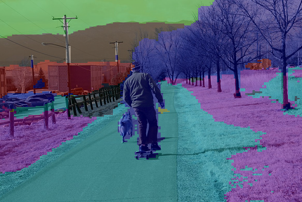

# AUB_C2.2

## Segmentation API with SegFormer

  This project is part of the AI in industry course -C2.2 assignment, where I deploy a pre-trained vision transformer model as a web API using Flask. The selected model performs **semantic segmentation** on images using Hugging Face’s `SegFormer`.

---

## How it works

- The user uploads an image via a `POST` request to the `/segment` endpoint.
- The server processes the image using a pretrained SegFormer model (`nvidia/segformer-b0-finetuned-ade-512-512`).
- A segmentation mask is generated and overlaid on the original image.
- The final result is returned as a PNG image.

---

## Setup

Make sure you have Python 3.8+ installed.

```bash
pip install -r requirements.txt
python app.py
```


## Example 

**Input Image:**


**Segmented Output:**



## Note

Due to time limitation , I worked on my two accounts to show collaboration and not with a collegue. 
